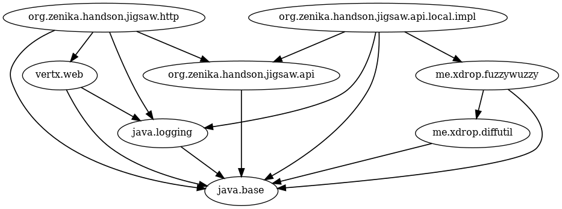

# Chapter 3 - Bringing justice and jigsaw into the world

Muni de vos pouvoirs de modularisation, vous allez à présent vous lancer dans le monde réel.

## Description de votre mission

Votre mission est de modulariser une application, listant les super-héros de votre ville, fonctionnant sous Java 8 pour la rendre compatible avec les futures versions de Java.

L'application est composée des plusieurs modules:

* `api-marvel`: Le module de base définissant l'interface de récupération des super-heros.
* `marvel-local-impl`: L'implémentation in-memory de l'interface définie dans `api-marvel`.
* `marvel-http-server`: Le server Vertx proposant une webapp et une API web utilisant `marvel-local-impl`.
* `fuzzywuzzy`: [La librairie de Fuzzy Search](https://github.com/xdrop/fuzzywuzzy) utilisée par `marvel-local-impl`.
* `diff-utils`: Le module nécessaire à `fuzzywuzzy` et regroupant différentes méthodes utiles au calcul de la distance de levenshtein.

Les intéractions entre ces modules peuvent se représenter ainsi:



**Gestion des dépendances**

L'ensemble du projet est géré avec [Gradle](https://gradle.org/).
La gestion des modules au moment de la compilation et d'exécution est géré par le plugin Gradle [chainsaw](https://github.com/zyxist/chainsaw).

> La version finale de l'application est déployée et disponible [ici](http://marvel.cleverapps.io).

> Si vous le désirez vous pouvez aussi utiliser l'image docker correspondante.

```
docker pull louiznk/marvel:10-debian
```

## Lancement de l'application avec Java 8

Rendez-vous sur le projet récupéré au chapitre 1 et déplacez-vous sur la branche `j8-vertx`.

```
git add .
git commit -m "feat: CHAPTER 2"
git checkout j8-vertx
```

Importez le projet dans votre IDE et lancer l'application avec Java 8 puis Java 9 (vous pouvez utiliser votre JAVA_HOME ou sdk use java `version` et pour connaitre les version que vous avez via sdkman `sdk list java`).

```
sdk use java <JAVA_8_VERSION>
./gradlew build
./gradlew run
```

```
sdk use java <JAVA_9_VERSION>
./gradlew build
./gradlew run
```

Constatez que l'application fonctionne en ouvrant votre navigateur sur l'URL [http://localhost:8080](http://localhost:8080) et notamment la page [infos](http://localhost:8080/infos).

> Dans cette page regardez les informations sur les modules (ou non).

## Récupération de l'application avec du code Java 9

Un de vos fidèles co-équipier a mis à jour le code pour qu'il utilise les dernières fonctionnalités proposées par Java 9.
Rendez-vous sur la branche `j9-vertx-classpath` et lancez l'application en utilisant Java 9 avec le classpath.

```
git checkout j9-vertx-classpath
./gradlew build
./gradlew run
```

Comme précédemment vous ne devriez pas avoir de module name sur la page [infos](http://localhost:8080/infos)

L'application doit fonctionner en mode classpath avec Java 9 (mais pas Java 8).

```
sdk use java <JAVA_9_VERSION>
./gradlew check run
```

Retournez sur la page [infos](http://localhost:8080/infos) et vous verrez les modules du JDK qui sont "chargés" (et toujours pas de module name).

## Modularisation de l'application: s'occuper du menu fretin.

Vous allez maintenant utiliser votre pouvoir pour modulariser votre application.
Commencez par modulariser les modules `api-marvel`, `diff-utils` et `fuzzywuzzy`.

Ajouter pour chaque module dans le fichier `build.gradle` le plugin chainsaw.

```
plugins {
    ...
    id 'com.zyxist.chainsaw' version '0.3.1'
}
```

N'hésitez à vous appuyer sur vos [TIPS](./TIPS.md) en cas de problème(s)!

Vérfiez que tout compile encore en lançant un build.

```
./gradlew clean build
```

## Modularisation de l'application: le bras droit

Modularisez à présent le module `marvel-local-impl`, attention cependant, celui-ci possède également des tests que vous vous sentez obligé de rendre passant. Pour qu'ils puissent s'exécuter en utilisant les modules faite la modification suivante dans le fichier `build.gradle` à la racine du projet.

```diff
[...]
    test {
        useJUnitPlatform()
-        environment "MARVEL", "CLASSPATH"
-        environment "HTTP", "CLASSPATH"
+        environment "MARVEL", "JIGSAW" // Enable some Jigsaw Specific Test for the marvel-local-impl module
+        environment "HTTP", "JIGSAW" // Enable some Jigsaw Specific Test for the marvel-http-server module
```

> Attention! IntelliJ n'exécute pas les tests en utilisant les modules.

Les tests ne devraient pas passer. Cela est dû à plusieurs problèmes:

* JUnit n'a pas accès à votre module par réflexivité.
* `InMemoryCharactersApi.java` charge les fichiers en utilisant `getClassLoader` qu'il faut remplacer par `getModule`.
* Les ressources ne sont pas accessibles par vos tests, il faut donc modifier gradle pour copier ces ressources dans le dossier de classes java.

```
test {
    ...
    doFirst {
        // can't access to file in resources directory => copy to java classes directory
        copy {
            from "$projectDir/src/main/resources"
            into "$buildDir/classes/java/main/"
        }
    }
}
```

Plus qu'un seul test devrait échouer, cele est dû au fait que les ressources dans `img` ne sont pas ouvertes (open) et que ces resources sont "protégées".
Effectuer les modifications nécessaires pour rendre tous les tests passant.

> Il y a notamment quelques précisions dans la javadoc suivante.

```
https://docs.oracle.com/javase/9/docs/api/java/lang/Module.html#getResourceAsStream-java.lang.String-

...
A resource in a named module may be encapsulated so that it cannot be located by code in other modules. Whether a resource can be located or not is determined as follows:

 * If the resource name ends with ".class" then it is not encapsulated.
 * A package name is derived from the resource name. If the package name is a package in the module then the resource can only be located by the caller of this method when the package is open to at least the caller's module. If the resource is not in a package in the module then the resource is not encapsulated.
...
```

Modifier le fichier `build.gradle` à la racine de votre projet et faites la modifications suivante.

```diff
subprojects {
  afterEvaluate {
    [...]
    test {
-       environment "MARVEL", "CLASSPATH"
+       environment "MARVEL", "JIGSAW"
    }
```

_Attention_ Chainsaw n'ouvre pas votre module au module `org.junit.platform.commons`. Afin que vos tests puissent fonctionner, il est nécessaire d'ajouter la configuration suivante dans le fichier `build.gradle` du module `marvel-local-impl`.

```
javaModule.hacks {
    exports('org.zenika.handson.jigsaw.api.local.impl', 'org.zenika.handson.jigsaw.api.local.impl', 'org.junit.platform.commons')
}
```

> Toujours pas K.O ? Il est temps de s'attaquer maintenant au BOSS, l'application Web.

## Modularisation de l'application: le BOSS

Modularisez à présent le serveur HTTP `marvel-http-server` qui, comme précédemment, contient des tests qui doivent fonctionner pour achever votre mission.

Ce module doit:

* permettre d'exposer les ressources statiques (fichier js, html, css, ...) de l'application web.
* utiliser l'implémentation de `org.zenika.handson.jigsaw.api.CharactersApi` (qui est fournit par le module `marvel-local-impl`).

Lancez votre application qui doit maintenant fonctionner en utilisant les modules.

> Bravo vous avez réussi à modulariser votre première application en utilisant les modules Java! Si vous êtes toujours vivant, continuez [au chapitre suivant](./CHAPTER_4.md).
