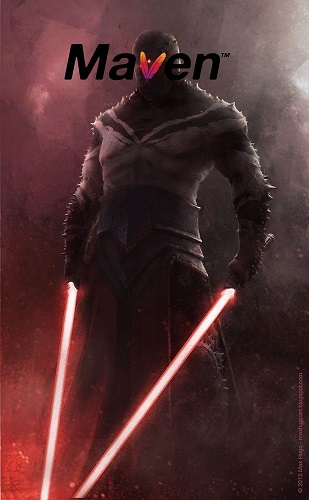
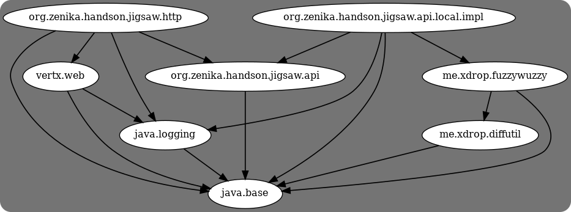
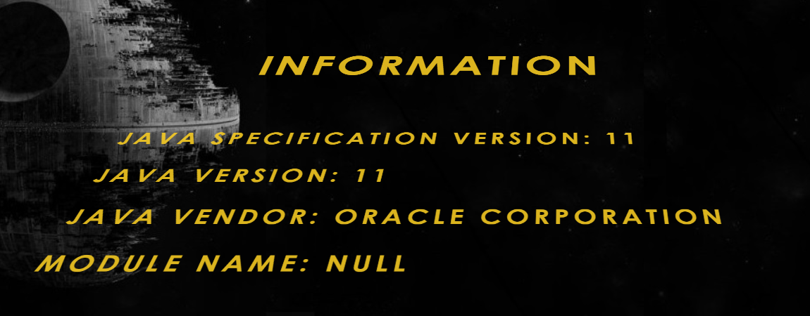

# Episode III - La revanche des Sith Maven



Le côté obscure est très tentant et vous vous laissez séduire par les pouvoirs de modularisation de Maven, vous prenez alors le nom de **Darth Jigsaw**.

## Devenir un seigneur Sith

Les Siths allant toujours par deux, vous allez à la rencontre de votre maître **Darth Maven**.

```
cd hands-on-jigsaw-devfest/2-sith
```

Votre maître vous demande de modulariser une application, contenant toutes les personnes clés de la galaxie, fonctionnant sous **Java 11** pour la rendre compatible avec les modules de Java.

L'application est composée de plusieurs modules `maven`:

* `api-starwars`: Le module de base contenant l'interface de définition et requêtage des personnages.
* `api-starwars-local-impl`: L'implémentation in-memory de l'interface définie dans `api-starwars`.
* `starwars-vertx-http-server`: Le server `Vertx` proposant une webapp et une API web utilisant `api-starwars-local-impl`.
* `fuzzywuzzy`: [La librairie de Fuzzy Search](https://github.com/xdrop/fuzzywuzzy) utilisée par `api-starwars-local-impl`.
* `diffutils`: Le module nécessaire à `fuzzywuzzy` et regroupant différentes méthodes utiles au calcul de la distance de levenshtein.

Les interactions entre ces modules peuvent se représenter ainsi:


_représentation des dépendances_

### Gestion des dépendances

En tant que Sith, votre outil de `build` est [Maven](https://maven.apache.org/).
Si vous n'avez pas installé `maven`en version >= 3.5, vous pouvez directement utiliser le script `mvnw` (ou `mvnw.bat`) à la racine du projet.

L'intégration de Jigsaw au moment de la compilation est géré automatiquement par `maven` (il détecte la présence du fichier `module-info`)

**C3P0_H3LP**
> La version finale de l'application est déployée et disponible [ici](https://starwars.zenika.com).
> Si vous le désirez vous pouvez aussi utiliser l'image docker correspondante.

```sh
docker run -ti -p8090:8080 louiznk/sw-bdm:11-distroless
```

L'application démarrée dans `docker` est accessible [ici](http://localhost:8090)

## Lancement de l'application avec Java 11

Importer dans votre IDE en tant que projet `maven` le dossier `2-sith` que vous avez récupéré pendant l'épisode I. Assurez-vous de bien utiliser un JDK 11 que ce soit dans votre IDE ou dans votre shell.

**C3P0_H3LP**
> Vous pouvez utiliser votre JAVA_HOME ou `sdkman` avec la commande `sdk use java <YOUR_VERSION>`.
> Pour connaitre les versions que vous possédez dans `sdkman`, lancer la commande `sdk list java`.

Vérifier que votre projet s'installe correctement.

```sh
./mvnw clean install
```

Lancer ensuite le serveur :

```sh
cd starwars-vertx-http-server
./mvnw exec:java
```

Constater que l'application fonctionne correctement en ouvrant votre navigateur sur l'URL [http://localhost:8080](http://localhost:8080) et notamment la page [infos](http://localhost:8080/infos).

**C3P0_H3LP**
> Dans la page info, regarder les informations sur les modules (ou non).

## Modularisation de l'application: maitriser le sabre

Vous allez maintenant développer votre habileté en modularisant votre application.

Commencer par modulariser `api-starwars`, `diff-utils` et `fuzzywuzzy`.

Ajouter, pour ces modules, le fichier `module-info.java` dans les répertoires `<DOSSIER>/src/main/java`.

Pour rappel les dépendances sont présentées dans le schéma _représentation des dépendances_.

N'hésiter à vous appuyer sur [C3P0_H3LP](./C3P0_HELP.md) en cas de problème(s)!

Vérifier que tout compile encore en lançant les tests depuis la racine du projet.

```sh
./mvnw clean test
```

Les tests unitaires doivent aussi passer depuis votre IDE.

## Modularisation du reste de l'application: maitriser le double sabre

Modulariser à présent le module `api-starwars-local-impl`. Attention cependant, en tant que Sith, le plugin `surefire` ne sait pas utiliser Jigsaw. Vos tests seront donc lancés avec le classpath classique.

**C3P0_H3LP**
> Attention! IntelliJ n'exécute pas les tests en utilisant les modules (tout comme maven-surefire).

## Modularisation de l'application: maitriser la télékinésie

Modulariser à présent le serveur HTTP `starwars-vertx-http-server`.

Ce module doit:

* permettre d'exposer les ressources statiques (fichier js, html, css, ...) de l'application web.
* utiliser l'implémentation de `org.zenika.handson.jigsaw.api.CharactersApi` (qui est fournit par le module `api-startwars-local-impl`).

Lancez le serveur web qui doit maintenant fonctionner en utilisant les modules.

Vous pensez avoir réussi ? Non, le côté obscure choisit la facilité mais votre maitre vous remet à votre place jeune apprenti!
 
Vous avez certes créé des modules mais vous ne les avez pas exécuté en tant que module. Voyer dans vos logs la marque du côté obscure.

```log
WARNING: An illegal reflective access operation has occurred
WARNING: Illegal reflective access by io.netty.util.internal.ReflectionUtil ...
WARNING: Please consider reporting this to the maintainers of io.netty.util.internal.ReflectionUtil
WARNING: Use --illegal-access=warn to enable warnings of further illegal reflective access operations
WARNING: All illegal access operations will be denied in a future release
```


_application lancé sans utiliser Jigsaw_

 Vous êtes resté dans la voix du classpath. Pour aller plus loin vous devez exécuter votre application en tant que module Jigsaw.

## Modularisation de l'application: maitriser la foudre

Faites en sorte que votre application démarre avec Jigsaw, pour cela modifier le fichier `./starwars-vertx-http-server/pom.xml`

Changer la configuration du plugin `exec-maven-plugin`. Remplacer `$$YOUR_MODULE_NAME$$` par le nom de votre module et `$$PATH_TO_YOUR_JAVA$$` par le chemin de votre exécutable java 11.

```xml
            <plugin>
                <groupId>org.codehaus.mojo</groupId>
                <artifactId>exec-maven-plugin</artifactId>
                <version>1.6.0</version>
                <configuration>
                    <executable>$$PATH_TO_YOUR_JAVA_EXE$$</executable>
                    <arguments>
                        <argument>--module-path</argument>
                        <modulepath/>
                        <argument>--module</argument>
                        <argument>$$YOUR_MODULE_NAME$$/org.zenika.handson.jigsaw.http.Application</argument>
                    </arguments>
                </configuration>
            </plugin>
```

Puis à la racine du projet

```sh
./mvnw install
cd starwars-vertx-http-server
./mvnw exec:exec
```

Vous devriez avoir l'erreur suivante :

```error
Exception in thread "main" java.util.ServiceConfigurationError: org.zenika.handson.jigsaw.api.CharactersApi: module starwars.http.server does not declare `uses`
	at java.base/java.util.ServiceLoader.fail(ServiceLoader.java:588)
	at java.base/java.util.ServiceLoader.checkCaller(ServiceLoader.java:574)
	at java.base/java.util.ServiceLoader.<init>(ServiceLoader.java:503)
	at java.base/java.util.ServiceLoader.load(ServiceLoader.java:1691)
	at starwars.http.server/org.zenika.handson.jigsaw.http.Application.<clinit>(Application.java:47)
```

Il va falloir maintenant montrer la vraie maitrise de la force. Pour cela

* indiquer que vous **utilisez** une implémentation de l'API (`api-starwars`)
* qui est **fournie** par l'implémentation (`api-starwars-local-impl`)
* vous devez aussi **ouvrir** les ressources images fournies par  (`api-starwars-local-impl`) pour quelles soient accessibles aux autres modules
* et enfin rendre disponible (c'est-à-dire ouvrir) **toutes** les ressources web exposées par Vert.x (dans `starwars-vertx-http-server`)

N'oublier que les [archives de votre droïde](./C3P0_HELP.md) sont d'une aide précieuses.

Pourquoi doit-on ouvrir les ressources que l'on partager ? car par défaut ces ressources sont "protégées".

**C3P0_H3LP**
> Il y a notamment quelques précisions dans la javadoc suivante.

```
https://docs.oracle.com/javase/9/docs/api/java/lang/Module.html#getResourceAsStream-java.lang.String-

...
A resource in a named module may be encapsulated so that it cannot be located by code in other modules. Whether a resource can be located or not is determined as follows:

 * If the resource name ends with ".class" then it is not encapsulated.
 * A package name is derived from the resource name. If the package name is a package in the module then the resource can only be located by the caller of this method when the package is open to at least the caller's module. If the resource is not in a package in the module then the resource is not encapsulated.
...
```

**Bravo vous avez réussi à modulariser votre première application en utilisant les modules Java!**

Malheureusement, vous réalisez que votre maître **Darth Maven** vous a caché des choses! A cause de `surefire`, vos tests sont toujours exécutés en mode classpath !!!
La maîtrise de Jigsaw par maven ne sera jamais complète!

> Pour en savoir plus, rendez vous [à l'épisode suivant](./EPISODE_4.md).