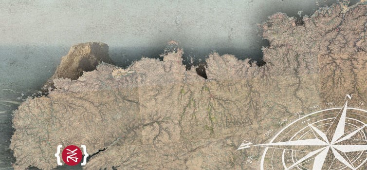
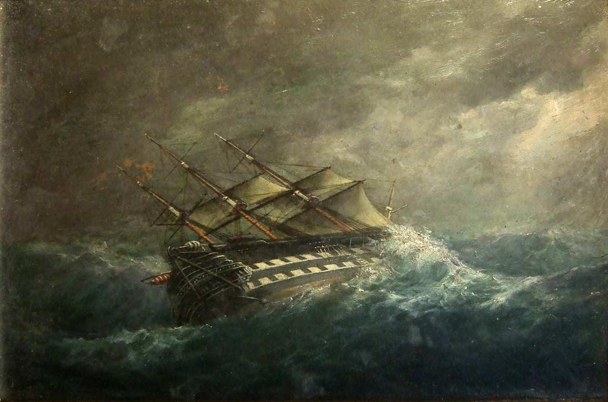
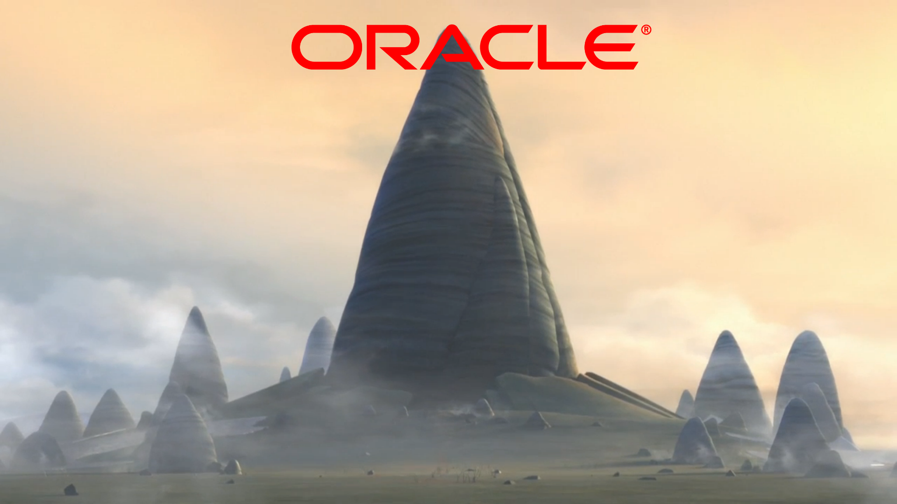

# A long time ago in a galaxy far far away...

Vous venez d'amarrer votre navire baptisé [Zenika](https://www.zenika.com) dans le port de [Brest](https://blog.zenika.com/2019/01/08/zenika-arrive-a-brest/). Cela fait maintenant plusieurs années que vous naviguez à travers l'Europe et cet arrêt au bout du monde vous permettra d'aller fêter avec votre équipage le fin de votre expédition.

Après quelques heures à festoyer à l'intérieur d'une taverne non loin du château de Brest, une personne encapuchonnée vous aborde et vous parle d'une ancienne prophétie à propos d'un nouveau monde plein de richesses et qui apporterait la gloire à celui qui le trouverais. Il n'en fallait pas plus à votre côté aventurier pour remettre les voiles et aller à la rencontre de votre succès!

Après plusieurs jours à naviguer, vous vous retrouvez au milieu d'une tempête d'un violence inouïe. Malgré le talent de votre équipage, votre navire se retrouve aspiré inexorablement dans un vortex sans fond et sans lumière...Ce n'est qu'après plusieurs minutes d'intenses secousses, que vous sortez de cet enfer sombre et réussissez à vous échouer à proximité d'un temple sur une terre inconnue. 

Vous décidez d'explorer ce temple. Après avoir déambuler à travers différents couloirs, vous tombez sur une fresque vous représentant vous et votre vaisseau sur cette planète. Sur ces murs sont dessinés des scènes de votre passé mais également des évènements que vous ne connaissez pas...en tout cas pas encore.

Plus tard, vous rencontrez l'homme encapuchonné qui vous avait accosté au bar il y a plusieurs jours. Il vous révèle qu'il est un **Oracle** d'une autre planète et que ce vortex vous à fait voyager à travers les étoiles dans une autre galaxie. Il vous révèle également pourquoi il vous a fait venir aux confins de l'univers.

Vous allez évoluer vers une nouvelle vie, une nouvelle version de vous-même. On vous a prédit que vous êtes une nouvelle perturbation de la Force et que vous serez...

> le Maître Jedi **JIGSAW**

Capable de maîtriser la force pour modulariser au build **ET** au runtime, vous apporterez à la planète Java l'équilibre entre l'open et le close.

Êtes-vous prêt à vouloir comprendre l'origine de vos pouvoirs et à les utiliser pour le bien de l'univers ?

> Si tel est le cas, rendez-vous au [prochain épisode](./EPISODE_1.md), où votre aventure commencera...

## Disclamer

Aucun Wookiee, Ewok ou Porg n'a été maltraité durant ce hands-on.

Les Jedi étant une espèce protégée, aucun ordre 66 n'a été exécuté pendant ce hands-on.

Aucun Sith n'a été trainé dans le côté claire de la force.

### Données

Les données utilisées sont celles de Starwars, elles appartiennent à Disney et leur usage doit être accompagné de ce copyright.

> Data provided by © Disney. All rights reserved.

Pour plus d'informations [https://disneytermsofuse.com](https://disneytermsofuse.com).

Tout le reste du code est en usage libre sans aucune restriction.

## Tools

Le frontend est développé en Vue.JS dont vous pourrez trouver les sources [ici](https://github.com/mathieumure/devfest-bdm-jigsaw-webapp)

La librairie de fuzzy search JavaWuzzy utilisée est disponible [ici](https://github.com/xdrop/fuzzywuzzy)
