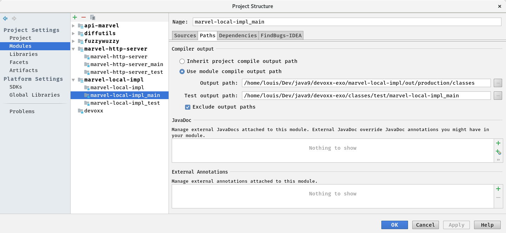

# TIPS

Une question, un doute sur votre pouvoir de modularisation? Vous trouverez tout ce qu'il vous faut ici!

## Fichier module-info.java

Ce fichier permet de décrire un module, il doit être présent à la racine des sources du module (ici dans src/main/java).
En "standard" l'arborescence des projets avec plusieurs modules diffère de celle que l'on retrouve classiquement :

[Exemple d'Oracle](http://openjdk.java.net/projects/jigsaw/quick-start) pour les modules `org.astro` et `com.greetings`

```
    src/org.astro/module-info.java
    src/org.astro/org/astro/World.java
    src/com.greetings/com/greetings/Main.java
    src/com.greetings/module-info.java
```

Mais il reste possible d'avoir une arborescence plus classique (ce qui sera fait ici) :

```
org.astro
    src/java/module-info.java
    src/java/org/astro/World.java
com.greetings
    src/java/com/greetings/Main.java
    src/java/module-info.java
```

Si votre module se nomme `nom.de.mon.module`, on retrouve ce nom dans la déclaration du module

```java
module nom.de.mon.module {
    // instructions
}
```

**TIPS**
Pour éviter les collisions dans les noms de modules, une pratique est de mettre des noms de modules identiques aux noms de package que l'on expose.

Un module peut contenir des instructions pour :

* Exposer les éléments publics d'un package : **exports**

```java
exports nom.du.package
```

* Permettre d'utiliser le module via de la reflexivité : **opens**

```java
opens nom.du.package
```

**Attention :** Cela permet aussi d'"ouvrir" à d'autres modules les ressources du package (des fichiers par exemple)

* Permettre à un module d'utiliser un autre module : **requires**

```java
requires nom.du.module
```

* Préciser que l'on fournit l'implementation d'une interface (pour pouvoir l'utiliser avec le ServiceLoader) : **provides** _ **with** _

```java
provides une.interface
              with une.implementation
```

* Pouvoir utiliser (grace au ServiceLoader) les implémentations d'une interface qui ont été définies via _provides * with *_ : **uses**

```java
uses une.interface
```

**Attention:** ces instructions n'incluent pas les sous-packages (si vous faites un export sur le package `a.b` le package `a.b.c` ne sera pas publique pour autant)

En résumé :

```java
module nom.de.mon.module {
    exports nom.du.package.aa; // rend accessible les objets publiques nom.du.package.aa du package
    exports nom.du.package.bb; // rend accessible les objets publiques nom.du.package.bb du package

    opens nom.du.package.aa; // ouvre à la reflexivité le package nom.du.package.aa, cela permet aussi d'accéder aux ressources du package

    requires nom.dun.autre.module; // permet d'utiliser les objets publiques du module nom.dun.autre.module
    requires nom.dun.second.module; // permet d'utiliser les objets publiques du module nom.dun.second.module

    provides nom.du.package.aa.InterfaceFoo with nom.du.package.cc.FooImpl; // fournit l'implémentation nom.du.package.cc.FooImpl de l'interface nom.du.package.aa.InterfaceFoo pour le ServiceLoader

    uses nom.dun.autre.module.InterfaceBar; // Permettra au ServiceLoader de récupérer les implémentations "provided" de l'interface nom.dun.autre.module.InterfaceBar présentes au runtime dans le module-path
}
```

### Pour aller plus loin

La gestion des dépendances peut être affinée :

* **requires transitive** _ZZZ_ : permet de spécifier dans le module la dépendances _ZZZ_ qui sera récupéré par transitivité pour les utilisateurs de ce module
* **requires static** _mysql.jdbc_: permet de gérer les dépendances optionnelles au runtime mais nécessaires à la compilation (ex : une appli qui peut utiliser une base oracle ou mysql ou … on mets un requires static sur les drivers spécifiques)

La portée de ce qui est exposé peut être limitée à des modules spécifiques :

* **exports** _process_ **to** _dev.random_ : expose les méthodes publiques du package _process_ (avec une portée limitée au module _dev.random_)

Le module peut être complètement ouvert (_a great power comes with great responsability_)

* **open** _module nom.de.mon.module_ **{}**

Le JDK étant lui même modulaire, pour connaitre la liste des modules et leurs dépendances :

* La [javadoc](https://docs.oracle.com/javase/9/docs/api/overview-summary.html) (en htm5, avec un search, la révolution...)
* Le [JDK Module Summary](http://cr.openjdk.java.net/~mr/jigsaw/jdk9-module-summary.html)
* De nouvelles options et programmes dans la CLI du JDK

```
java -p api-marvel/build/libs/api-marvel.jar --describe-module org.znk.handson.jigsaw.api
jar --file=api-marvel/build/libs/api-marvel.jar --describe-module
jdeps --module-path ./api-marvel/build/libs/api-marvel.jar -recursive ./marvel-local-impl/build/libs/marvel-local-impl.jar
...
```

## [javac](https://docs.oracle.com/javase/9/tools/javac.htm#JSWOR627) et les modules

Quand vous construisez un module il est nécessaire de lui spécifier le chemin des modules **requires** qui ne sont pas fournis par le JDK (ceux packagés avec votre JDK sont par défaut accessibles).

```sh
javac ... --module-path PATH ...
# équivaut à
javac ... -p PATH ...
```

Avec **PATH** qui est la listes des modules (sous formes de JAR, mais peut aussi être des classes et des répertoires; utilise le séparateur du système). Pour retenir : **les classes sont dans le classpath, les modules sont dans le modulepath**.

Astuces :

* dans le cas de jar legacy il est possible de combiner classpath (legacy) et modulepath
* dans le cas de multimodules avec des dépendances, on peut utiliser la notion de module-source-path
* dans le cas de tests unitaire, les dépendances et les droits d'accès peuvent être ajoutés sans modifier le fichier module-info.java

```sh
# avec junit (4 et 5)
javac ... --add-modules junit --add-reads nom.de.mon.module=junit ...
```

* et le patch d'un module pour lui ajouter les classes de tests (car les packages sont scélés)

```sh
javac ... --patch-module nom.de.mon.module=src/test/java... ...
```

## [java](https://docs.oracle.com/javase/9/tools/java.htm#JSWOR624) et les modules

Même idée que pour javac **les classes sont dans le classpath, les modules sont dans le modulepath**, pour lancer le `main` de la classe `ma.MainClass` du module `nom.de.mon.module` :

```sh
java ... --module-path PATH --module nom.de.mon.module/ma.MainClass ...
# équivaut à
java ... -p PATH -m nom.de.mon.module/ma.MainClass ...
```

Avec **PATH** qui est la liste des modules (sous formes de JAR, mais peut aussi être des classes et des répertoires; utilise le séparateur du système

Pour les tests unitaires il faut, là aussi, modifier les droits et dépendances pour que nos librairies de tests puissent accéder à notre module et que notre classe de tests puisse les utiliser.

```sh
# avec junit 4.12 & hamcrest
java ...  --module-path PATH
          --add-modules junit \
          --add-reads nom.de.mon.module=junit \
          --add-reads nom.de.mon.module=hamcrest.core \
          --add-exports nom.de.mon.module/nom.du.package=junit \
          --add-exports nom.de.mon.module/nom.du.package=hamcrest.core \
          --patch-module nom.de.mon.module=src/test/java... \
          ...
```

* **--add-reads** : permet au runtime de rendre accessible au module _nom.de.mon.module_ un module qui n'est pas _required_ (ici _junit_)
* **--add-exports** : permet au runtime de rendre exportable le package _nom.du.package_ du module _nom.de.mon.module_ à un autre module qui n'y aurait normalement pas accès (ici _junit_)
* **--add-opens** : idem que **--add-exports** mais ouverture complète à la reflexivité (inutile dans notre cas puisque la réflexivité est réalisée via de l'indirection depuis le même module)
* **--patch-module** : permet de patcher un module en lui ajoutant des classes non présentes initialement (permet d'avoir pour les tests unitaire des noms de package identique à ce qui est testé ce qui n'est pas autorisé par défaut)

## Gradle

Un wrapper de Gradle est directement disponible dans le projet en version 4.6. Pour le lancer depuis la racine du projet

```
./gradlew

> Task :help

Welcome to Gradle 4.6.

To run a build, run gradlew <task> ...

To see a list of available tasks, run gradlew tasks
...
...
```

Le premier lancement va être un peu plus long car il va télécharger la distribution de gradle.

La liste des principales `tasks` utiles au projet

* `check` (ou `test`) : lance les tests unitaires (les tests ne sont pas exécutés si le code n'a pas changé)
* `compileJava` : lance la compilation des classes java (seul le code qui change est compilé)
* `build` : lance la compilation et les tests unitaires
* `run` : lance la main classe (pour les applications seulement). Cette commande ne termine "jamais" et reste à un état d'avancement de 95%
* `jar` : package le projet, les modules sous forme de jar
* `clean` : efface le resultat du build, permet par exemple de forcer l'execution des tests s'il n'y a pas eu de modification de code
* `installDist` : _optionnel_ génère une distribution du projet avec son script de lancement, ses librairies et ses dépendances

Autre commandes utiles à gradle ;

* `--status` : affiche le status des daemons gradle
* `--stop` : arrête les daemons gradle

Gradle fonctionne en mode classpath, cependant il est possible (et c'est ce pourquoi vous êtes ici) de changer cela.
2 approches sont possibles :

* Utiliser le plugin chainsaw (il existe un plugin officiel expérimental mais il est moins avancé)
* Surcharger les taks spécifiques de compilation, execution et tests

### Utiliser le plugin chainsaw

Il suffit d'ajouter dans les plugins du(/des) projet(s), le plugin com.zyxist.chainsaw

```diff
plugins {
    id 'java-library'
+   id 'com.zyxist.chainsaw' version '0.3.1'
}
```

**Attention** avec JUnit 5 il faut ouvrir les packages que l'on teste au module `org.junit.platform.commons`

```groovy
javaModule.hacks {
    exports('<NOM_DU_MODULE>', '<PACKAGE_A_EXPOSER>', 'org.junit.platform.commons')
}
```

### Utiliser la configuration gradle

#### Définir dans la variable le nom du module

La variable `moduleName` sera utilisée par la suite (notamment dans les tests)

```diff
plugins {
    id 'java-library'
}

+ ext.moduleName = "org.zenika.handson.jigsaw.api"
```

#### Surcharger les options de compilation

Dans votre build.gradle afin d'avoir un `modulepath` alimenté à partir de ce qui irait normalement dans le `classpath`

```groovy
    compileJava {
        doFirst {
            options.compilerArgs = [
                    '--module-path', classpath.asPath, // alimente le modulepath via le classpath
            ]
            classpath = files() // vide le classpath
        }
    }
```

#### Surcharger les options de compilation des tests

Pour les tests en plus du modulepath il faut :

* Modifier le graph de dépendance pour y ajouter le module junit
* Modifier le graph de dépendance pour que le module puisse utiliser junit (équivaut à un `requires`)
* Patcher le module pour forcer l'inclusion des classes de tests dans le package (les packages sont scellés, les tests étant dans un autre répertoire mais dans le même package, les mécanismes de protection de Jigsaw s'activent)

```groovy
    compileTestJava {
        inputs.property("moduleName", moduleName) // la variable moduleName doit être déclarée dans chaque build.gradle des modules
        doFirst {
            options.compilerArgs = [
                    '--module-path', classpath.asPath,
                    '--add-modules', 'org.junit.jupiter.api', // junit fait maintenant partie du graphe des modules alors qu'il n'a pas de dépendance transitive
                    '--add-reads', "$moduleName=org.junit.jupiter.api", // equivaut à faire dans le module un requires org.junit.jupiter.api
                    '--add-reads', "$moduleName=org.junit.platform.commons", // idem ...
                    '--patch-module', "$moduleName=" + files(sourceSets.test.java.srcDirs).asPath, // patch le module
            ]
            classpath = files()
        }
    }
```

#### Surcharger les options d'exécution

Il faut en plus :

* Spécifier la main classe qui sera lancée (via un --module)

> Cette configuration s'applique au plugin `application`

```groovy
plugins {
    id 'application'
}
...
mainClassName = "$moduleName/org.zenika.handson.jigsaw.http.Application"

run {
    inputs.property("moduleName", moduleName)
    doFirst {
        jvmArgs = [
                '--module-path', classpath.asPath,
                '--module', mainClassName, // utiliser l'option module pour lancer la "main class"
        ]
        classpath = files()
        copy {
            // Les ressources étant encore dans un répertoire différent, elles ne sont pas accessibles avec l'isolation de Jigsaw => il faut donc les copier dans le répertoire contenant les classes
            from 'src/main/resources'
            into "$buildDir/classes/java/main/"
        }
    }
}
```

#### Surcharger les options d'exécution des tests

Il faut en plus :

* `add-export` pour exposer à junit les packages qui seront testés
* `add-modules ALL-MODULE-PATH` pour ajouter dans le graphe de résolution tous les modules (et auto modules) qui sont dans le module-path

```groovy
test {
    inputs.property("moduleName", moduleName)
...
    doFirst {
        // Hack Les ressources étant encore dans un répertoire différent elles ne sont pas accessibles avec l'isolation de Jigsaw => il faut donc les copier dans le répertoire contenant les classes
        copy {
            from "$projectDir/src/main/resources"
            into "$buildDir/classes/java/main/"
        }

        jvmArgs = [
                //'--show-module-resolution', // le pouvoir de vision peut vous sauver la vie
                '--module-path', classpath.asPath,
                '--add-modules', 'ALL-MODULE-PATH',
                '--add-reads', "$moduleName=org.junit.jupiter.api",
                '--add-reads', "$moduleName=org.junit.platform.commons",
                '--add-reads', "$moduleName=feign.core",
                '--add-reads', "$moduleName=feign.gson",
                '--add-exports', "$moduleName/$moduleName=org.junit.jupiter.api",
                '--add-exports', "$moduleName/$moduleName=org.junit.platform.commons",
                '--patch-module', "$moduleName=" + files(sourceSets.test.java.outputDir).asPath,
        ]
        classpath = files()
        }
}
```

## IDEA et les modules

La prise en charge des modules ne se limite pas à gérer la phase de compilation. Il faut aussi le prendre en compte en phase d'exécution.

IDEA gère cela pour les applications, pour les tests l'IDE utilise encore le classpath (ce qui évite d'avoir à gérer les patchs, add-export et autres joies des tests unitaires avec les modules).

IDJ ne prend pas en compte tous les cas complexes que l'on peut rencontrer avec les ressources et les modules :

* Dans un livrable packagé (ex: un jar), les ressources sont dans la même arborescence que les classes, les classes peuvent donc accéder aux ressources sans faire face aux restrictions d'accès des modules
* En phase de développement les ressources et les classes compilées sont dans des arborescences différentes, à l'exécution ces arborescences sont passées en arguments de `java`. Les classes étant positionnées ailleurs elles n'ont pas accès aux ressources.

```
java ... .../marvel-http-server/out/production/classes:.../marvel-http-server/out/production/resources:.../devoxx-exo/marvel-local-impl/out/production/classes:.../marvel-local-impl/out/production/resources:... -m org.zenika.handson.jigsaw.http/org.zenika.handson.jigsaw.http.Application
```

Dans notre application les ressources sont incluses dans le code et donc accédées via le classloader ce qui ne marche pas dans le cas présent. Il est cependant possible de contourner cela, en choisissant pour les modules qui ont ce besoin (`org.zenika.handson.jigsaw.api.local.impl` et `org.zenika.handson.jigsaw.http`), d'utiliser dans IDJ une arborescente en developpement spécifique au runtime (File/Project Structure/Project Settings/Module...**Use module compile output path** voir copie d'écran)



## Génération de modules "linkés" et JRE optimisé

Ces fonctions avancées permettent d’avoir une application packagée avec une JVM allégée ainsi qu’un graphe des dépendances déjà calculé et contrôlé pour optimiser le temps de démarrage.

**Attention** cette fonctionnalité est limitée aux modules (on ne peut pas inclure de jar legacy ou d'auto-modules pour générer un JRE optimisé)

```sh
# generation des jar
./gradlew jar

# generation de la JVM packagée avec nos modules et ses dépendances
jlink \
--module-path $JAVA_HOME/jmods:`pwd`/api-marvel/build/libs/api-marvel.jar:...liste_des_binaires_modules_ou_repertoire....   \
--add-modules org.zenika.handson.jigsaw.api.local.impl,...liste_des_noms_des_modules...\
--output `pwd`/marveljre --launcher marvelous=org.zenika.handson.jigsaw.http/org.zenika.handson.jigsaw.http.Application \
--compress=2

# affichage des modules de notre JRE optimisé
./marveljre/bin/java --list-modules
```

La liste des modules de notre JRE "light" est

* java.base@9.0.4
* java.logging@9.0.4
* jdk.httpserver@9.0.4
* me.xdrop.diffutils
* me.xdrop.fuzzywuzzy
* org.zenika.handson.jigsaw.api
* org.zenika.handson.jigsaw.api.local.impl
* org.zenika.handson.jigsaw.http open

La version @9.0.4 est celle de la JVM "source". Si l'on voulait avoir un numéro de version il faut générer le jar avec l'option _--module-version_ (mais cette information n'est malheureusement pas exploitée pour gérer les versions des modules)
